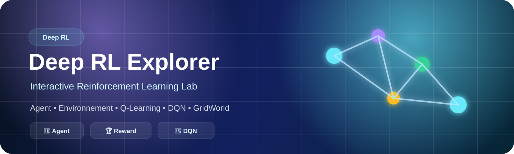
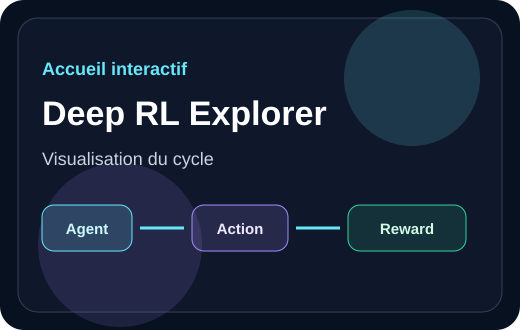
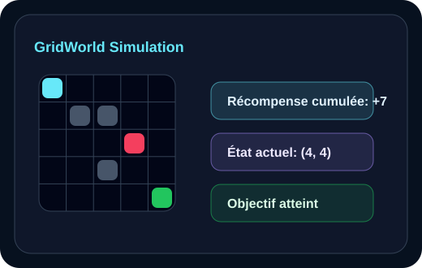
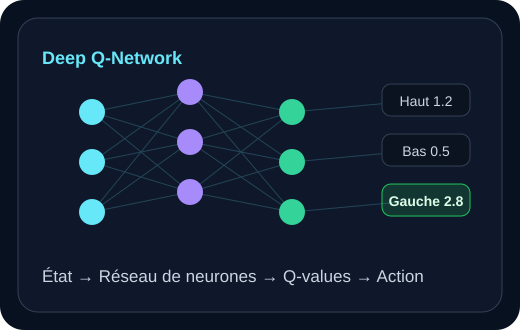

<p align="center">
  
</p>

<h1 align="center">🧠 Deep RL Explorer</h1>

<p align="center">
  <strong>Une application web interactive pour apprendre le Deep Reinforcement Learning par la visualisation, la simulation et l’expérimentation.</strong>
</p>

<p align="center">
  
  
  
  
  
</p>

<p align="center">
  <a href="#-démo-en-ligne">Démo</a>
  ·
  <a href="#-aperçu-visuel">Aperçu</a>
  ·
  <a href="#-fonctionnalités">Fonctionnalités</a>
  ·
  <a href="#-installation-locale">Installation</a>
  ·
  <a href="#-auteur">Auteur</a>
</p>

---

## ✨ Présentation

**Deep RL Explorer** est une réalisation pratique moderne conçue pour un cours de **Deep Reinforcement Learning**.

Le projet transforme les notions théoriques du Deep RL en une expérience interactive : l’utilisateur peut explorer les concepts, manipuler une simulation GridWorld, visualiser une courbe d’apprentissage et comprendre le rôle d’un réseau de neurones dans un Deep Q-Network.

> 🎯 Objectif : rendre le Deep Reinforcement Learning plus clair, plus visuel et plus mémorable qu’un simple notebook.

---

## 🌐 Démo en ligne

<p align="center">
  <a href="https://younlam9.github.io/DeepRL-Explorer/">
    
  </a>
</p>

<p align="center">
  <strong>🔗 Lien du projet :</strong>
  <a href="https://younlam9.github.io/DeepRL-Explorer/">https://younlam9.github.io/DeepRL-Explorer/</a>
</p>

---

## 🖼️ Aperçu visuel

<p align="center">
  
  
  
</p>

---

## 🎓 Objectif pédagogique

L’application explique comment un agent apprend à prendre de meilleures décisions en interagissant avec un environnement.

Elle met en avant les idées principales du Deep RL :

- 🧩 un agent observe un état ;
- 🎮 il choisit une action ;
- 🌍 l’environnement réagit ;
- 🏆 une récompense guide l’apprentissage ;
- 📈 la stratégie s’améliore progressivement ;
- 🧠 un réseau de neurones peut remplacer une Q-table classique.

---

## 🚀 Fonctionnalités

| Module | Description |
| --- | --- |
| 🏠 Hero interactif | Introduction moderne avec animation du cycle Agent → Action → Environnement → Récompense |
| 🧠 Concepts RL | Cartes interactives pour Agent, État, Action, Politique, Q-value, Exploration, Exploitation |
| 🔁 Agent-Environnement | Schéma animé et cliquable du cycle d’apprentissage |
| 🤖 GridWorld | Simulation 5x5 avec agent, objectif, piège, obstacles, score et état courant |
| 🎯 Contrôles | Déplacement manuel, reset et simulation automatique |
| 📐 Q-Learning | Formule interactive avec explication des symboles |
| 🧮 Exemple numérique | Calcul détaillé d’une nouvelle Q-value |
| 📊 Learning Chart | Courbe de récompense cumulée avec Recharts |
| 🧬 DQN Visualizer | Réseau de neurones animé avec Q-values fictives |
| ⚖️ Comparaison | RL classique vs Deep Reinforcement Learning |
| 🌍 Applications | Jeux vidéo, robotique, voitures autonomes, santé, finance, énergie, agriculture et logistique |

---

## 🛠️ Stack technique

<p align="center">
  
</p>

- **React** pour l’interface utilisateur
- **Vite** pour un environnement rapide et moderne
- **Tailwind CSS** pour le design responsive
- **Framer Motion** pour les animations fluides
- **Recharts** pour les graphiques pédagogiques
- **Lucide React** pour les icônes
- **JavaScript / JSX** pour le développement des composants

---

## 📁 Structure du projet

```text
DeepRL-Explorer/
├── public/
├── src/
│   ├── components/
│   │   ├── Hero.jsx
│   │   ├── ConceptCards.jsx
│   │   ├── AgentEnvironmentDiagram.jsx
│   │   ├── GridWorldSimulation.jsx
│   │   ├── QLearningSection.jsx
│   │   ├── LearningChart.jsx
│   │   ├── DQNVisualizer.jsx
│   │   ├── ComparisonSection.jsx
│   │   ├── ApplicationsSection.jsx
│   │   ├── Conclusion.jsx
│   │   └── Navbar.jsx
│   ├── data/
│   │   └── concepts.js
│   ├── App.jsx
│   ├── main.jsx
│   └── index.css
├── package.json
├── vite.config.js
├── tailwind.config.js
└── README.md
```

---

## 💻 Installation locale

Cloner le projet :

```bash
git clone https://github.com/Younlam9/DeepRL-Explorer.git
```

Entrer dans le dossier :

```bash
cd DeepRL-Explorer
```

Installer les dépendances :

```bash
npm install
```

Lancer l’application :

```bash
npm run dev
```

Ouvrir dans le navigateur :

```text
http://localhost:5173/DeepRL-Explorer/
```

---

## 🧪 Commandes utiles

```bash
npm run dev
npm run build
npm run preview
npm run lint
```

---

## 👤 Auteur

<h3 align="center">Youness Lamrini</h3>

<p align="center">
  <a href="https://github.com/Younlam9">
    
  </a>
  <a href="https://www.linkedin.com/in/youness-lamrini-987963286/">
    
  </a>
</p>

---

<p align="center">
  ⭐ Projet académique réalisé pour présenter le Deep Reinforcement Learning de manière interactive.
</p>
